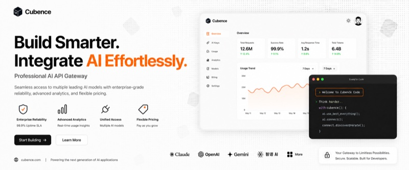

# superpowers-zh（AI 編程超能力 · 中文增強版）

🌐 [简体中文](README.md) | **繁體中文** | [English (upstream)](https://github.com/obra/superpowers)

> 🦸 **superpowers（250k+ ⭐）完整漢化 + 4 個中國原創 skills** — 讓 Claude Code / Copilot CLI / Hermes Agent / Cursor / Windsurf / Kiro / Gemini CLI / Qoder 等 **24 款 AI 編程工具**真正會幹活。從頭腦風暴到程式碼審查，從 TDD 到除錯，每個 skill 都是經過實戰驗證的工作方法論。

Chinese community edition of [superpowers](https://github.com/obra/superpowers) — 20 skills across 24 AI coding tools, including full translations and China-specific development skills.

[](https://sp.aiolaola.com)
[](https://github.com/jnMetaCode/superpowers-zh)
[](https://www.npmjs.com/package/superpowers-zh)
[](https://opensource.org/licenses/MIT)
[](https://makeapullrequest.com)

> 📖 **免費配套學習** → [從零學會 AI 編程](https://aiolaola.com/zh-Hant?utm_source=github&utm_campaign=superpowers-tw)(180 節)＋ [AI 智能體課程](https://aiolaola.com/zh-Hant/course/agents?utm_source=github&utm_campaign=superpowers-tw)(40 節)— 繁體中文實作課程,免費

> 📖 **免費配套學習** → [從零學會 AI 編程](https://aiolaola.com/?utm_source=github&utm_campaign=superpowers)：180 節免費實操課 + 《AI 編程實戰三卷書》線上閱讀 + 實戰社群 · superpowers 裝好後配上方法論效率翻倍 · 永久免費

> 🆕 **v1.7.10 更新亮點** —— **Aider / Kiro / Hermes 使用者請重裝**（此前裝了等於沒裝）：
>
> - 🐛 **Aider** —— 真實 Aider 專案從來沒被自動偵測到過（它不建立 `.aider/` 目錄），且 `CONVENTIONS.md` **不會**被自動載入（官方要求 `--read`）。現在偵測認真實標記，裝完列印啟用命令
> - 🐛 **Kiro** —— `.kiro/steering/` 下的檔案**每輪對話全量進上下文**，而我們把 20 個 skill 正文全塞了進去：實測 **335 KB/輪**。改為索引式後 **4.4 KB**（76 倍），重裝會自動清舊佈局
> - 🐛 **Hermes** —— 之前只裝專案級 `.hermes/skills/`，而 Hermes 根本不讀那個目錄。現在改用 `npx superpowers-zh --global --tool hermes` 裝到 `~/.hermes/skills/`
> - 🆕 **新增 Crush**（工具數 22 → 23）—— 若你已為 CC / Cursor / Codex 裝過，Crush 其實已經能讀到，別重複裝
>
> 📋 其餘改動（Qoder 工具對映表更正、上游 v6.2.0 對齊、測試盲區補齊、Windows bootstrap 修復、SDD 同步…）見 **[完整 Release Notes →](RELEASE-NOTES.zh.md)**

### 📊 專案規模

| 📦 翻譯 Skills | 🇨🇳 中國特色 Skills | 🤖 支援工具 |
|:---:|:---:|:---:|
| **14** | **6** | **Claude Code / Copilot CLI / Hermes Agent / Cursor / Windsurf / Kiro / Gemini CLI / Codex / Aider / Trae / VS Code (Copilot) / DeerFlow / OpenCode / OpenClaw / Qwen Code / Antigravity / Claw Code / Qoder / Qoder CN / CodeBuddy（騰訊）/ CodeArts（華為雲碼道）/ Cline / Kilo Code / Crush** |

---

## ❤️ 贊助商 &nbsp;<sub>🙏 想出現在這裡？聯絡 **jnMetaCode@qq.com** 贊助</sub>

<table>
<tr>
<td width="25%">
  <a href="https://passport.compshare.cn/register?referral_code=ETD3L5JBM13CtKARkMORot&ytag=GPU_YY_YX_git_superpowers-zh">
    
  </a>
</td>
<td width="75%" valign="middle">

感謝 [優雲智算](https://passport.compshare.cn/register?referral_code=ETD3L5JBM13CtKARkMORot&ytag=GPU_YY_YX_git_superpowers-zh) 贊助本專案！優雲智算是 UCloud 旗下 AI 雲平台，主打包月、按次的高性價比國模 Agent Plan 方案，支援 GLM-5.2，低至 **49 元/月**起。同時提供官轉穩定海外模型。支援接入 Claude Code、Codex 及 API 呼叫。支援企業高併發、7×24 技術支援、自助開票。🎁 **透過[此連結](https://passport.compshare.cn/register?referral_code=ETD3L5JBM13CtKARkMORot&ytag=GPU_YY_YX_git_superpowers-zh)註冊的使用者，可得免費 5 元平台體驗金！**

</td>
</tr>
</table>

<table>
<tr>
<td width="25%">
  <a href="https://cubence.com/signup?code=SCW29JP9">
    
  </a>
</td>
<td width="75%" valign="middle">

感謝 [Cubence](https://cubence.com/signup?code=SCW29JP9) 對本專案的支持。Cubence 是一家致力為客戶提供穩定、高效的 API 中轉服務商。從 25 年 9 月營運至今，提供了 Claude Code、Codex、Gemini 等多種模型支援。🎁 **Cubence 為本開源專案的使用者提供了特別的專屬優惠碼 `AGENCY`，透過[此連結](https://cubence.com/signup?code=SCW29JP9)註冊的使用者，首次購買即可享受 9 折優惠！**

</td>
</tr>
</table>

---

## 這是什麼？

[superpowers](https://github.com/obra/superpowers) 是目前最火的 AI 編程 skills 框架（250k+ stars），為 AI 編程工具提供**系統化的工作方法論**。

**superpowers-zh** 在完整翻譯的基礎上，新增了面向中國開發者的特色 skills。

<!-- 效果對比 -->
<table>
<tr><td>

**沒裝 superpowers-zh：**
```
你：給使用者模組加個批次匯出功能
AI：好的，我來實作...（直接開始寫程式碼）
    export async function exportUsers() { ... }
你：等等，格式不對，沒分頁，大量資料會 OOM...
```

</td><td>

**裝了 superpowers-zh：**
```
你：給使用者模組加個批次匯出功能
AI：在開始實作之前，我需要了解幾個關鍵問題：
    1. 匯出格式是 CSV 還是 Excel？
    2. 預計資料量多大？需要非同步處理嗎？
    3. 有權限要求嗎？
    → 給出 2-3 個方案，確認後再動手
```

</td></tr>
</table>

### 🆚 與英文上游的區別（老被問，一次說清）

| 維度 | superpowers（英文上游） | superpowers-zh（中文增強版） |
|------|----------------------|---------------------------|
| ⭐ Star 數 | 250k+ | — |
| 📦 Skills 總數 | 14 | **20**（14 翻譯 + 4 國產原創 + 2 上游歷史保留） |
| 🌐 語言 | 英文 | 中文（技術術語保留英文） |
| 🤖 **支援工具** | **6 款**：Claude Code / Cursor / Codex / OpenCode / Copilot CLI / Gemini CLI | **24 款**：上述 6 款 + Hermes Agent / Trae / Kiro / Qwen Code / OpenClaw / Claw Code / Antigravity / DeerFlow / VS Code / Windsurf / Aider / Qoder / Qoder CN / CodeBuddy（騰訊） / CodeArts（華為雲碼道） / Cline / Kilo Code / Crush |
| ⚡ **安裝方式** | 按工具分別裝（每款一條不同的 plugin marketplace 命令） | **`npx superpowers-zh` 一條命令自動識別專案裡的工具並安裝**；識別不出可 `--tool <name>` 顯式指定 |
| 🇨🇳 Git 平台 | GitHub 為主 | GitHub + Gitee + Coding + 極狐 GitLab + **CNB（騰訊雲原生建置）** |
| 🇨🇳 CI/CD 範例 | GitHub Actions | GitHub Actions + Gitee Go + Coding CI + 極狐 CI + `.cnb.yml` |
| 🇨🇳 程式碼審查風格 | 西方直接風格 | 適配國內團隊溝通文化 |
| 🇨🇳 Git 提交規範 | 無 | Conventional Commits 中文適配 |
| 🇨🇳 中文文件規範 | 無 | 中文排版 + 中英混排規則 + 告別機翻味 |
| ➕ MCP 伺服器建置 | 無 | 獨立 `mcp-builder` skill |
| ➕ 工作流執行器 | 無 | 獨立 `workflow-runner` skill（多角色 YAML 編排） |
| ➕ 翻譯 skill 內的增量 | — | 僅 2 處，均在正文顯式標註「本節是 superpowers-zh 的增量內容」：`executing-plans` 的「常見異常處理」、`using-superpowers` 的「中國特色技能路由」。**上游各節均為逐節翻譯，不被改動**；audit 會強制未標註的增量報錯 |
| 🔄 版本跟進 | 獨立迭代 | **同步上游 + 國產增量疊加** |
| 🤝 接受新 skill PR | 一般不接受（原文：*"we don't generally accept contributions of new skills"*） | 歡迎 PR（中國開發者痛點優先） |
| 💬 社群 | Discord | 微信公眾號「AI不止語」+ 微信群 + QQ 群 |
| 📜 License | MIT | MIT |

**一句話總結：** 英文上游 = 方法論核心；中文增強版 = 方法論核心 **+** 24 款工具一鍵適配 **+** 國內 Git/CI 生態 **+** 中文化表達習慣。

### 🤖 支援 24 款主流 AI 編程工具

| 工具 | 類型 | 一鍵安裝 | 手動安裝 |
|------|------|:---:|:---:|
| [Claude Code](https://claude.ai/code) | CLI | `npx superpowers-zh` | `.claude/skills/` |
| [Copilot CLI](https://githubnext.com/projects/copilot-cli) | CLI | `npx superpowers-zh --tool copilot` | `.claude/skills/` |
| [Hermes Agent](https://github.com/NousResearch/hermes-agent) | CLI | `npx superpowers-zh --global --tool hermes` | `~/.hermes/skills/` |
| [Cursor](https://cursor.sh) | IDE | `npx superpowers-zh` | `.cursor/skills/` |
| [Windsurf](https://windsurf.com) | IDE | `npx superpowers-zh` | `.windsurf/skills/`（全局 `~/.codeium/windsurf/skills/`） |
| [Kiro](https://kiro.dev) | IDE | `npx superpowers-zh` | `.kiro/skills/` |
| [Gemini CLI](https://github.com/google-gemini/gemini-cli) | CLI | `npx superpowers-zh` | `.gemini/skills/` |
| [Codex CLI](https://github.com/openai/codex) | CLI | `npx superpowers-zh` | `.agents/skills/` |
| [Aider](https://aider.chat) | CLI | `npx superpowers-zh` | `.aider/skills/` |
| [Trae](https://trae.ai) | IDE | `npx superpowers-zh` | `.trae/skills/` + `.trae/rules/` |
| [VS Code](https://code.visualstudio.com) (Copilot) | IDE 外掛 | `npx superpowers-zh` | `.github/superpowers/` + `.github/instructions/` |
| [DeerFlow 2.0](https://github.com/bytedance/deer-flow) | Agent 框架 | `npx superpowers-zh` | `skills/custom/` |
| [OpenCode](https://opencode.ai) | CLI | `npx superpowers-zh` | `.opencode/skills/` |
| [OpenClaw](https://github.com/openclaw/openclaw) | CLI | `npx superpowers-zh` | `skills/` |
| [Qwen Code](https://github.com/QwenLM/qwen-code) | CLI | `npx superpowers-zh` | `.qwen/skills/` + `QWEN.md` |
| [Antigravity](https://antigravity.google) | CLI | `npx superpowers-zh` | `.agents/skills/` |
| [Claw Code](https://github.com/ultraworkers/claw-code) | CLI (Rust) | `npx superpowers-zh` | `.claw/skills/` |
| [Qoder](https://qoder.com) (阿里 AI IDE) | IDE | `npx superpowers-zh` | `.qoder/skills/` + `.qoder/rules/` |
| [CodeBuddy](https://copilot.tencent.com) (騰訊 AI IDE) | IDE | `npx superpowers-zh` | `.codebuddy/skills/` + `CODEBUDDY.md` |
| [華為雲碼道 CodeArts](https://codearts.huaweicloud.com/) | IDE | `npx superpowers-zh` | `.codeartsdoer/skills/` |
| [Cline](https://cline.bot) | IDE 外掛 | `npx superpowers-zh --tool cline` | `.cline/skills/` + `.clinerules/` |
| [Kilo Code](https://kilo.ai) | IDE 外掛 | `npx superpowers-zh --tool kilocode` | `.kilocode/skills/` + `.kilocode/rules/` |
| [Crush](https://github.com/charmbracelet/crush) | CLI | `npx superpowers-zh` | `.crush/skills/` |

> 執行 `npx superpowers-zh` 會自動偵測你專案中使用的工具，將 20 個 skills 安裝到正確位置。

### 翻譯的 Skills（14 個）

| Skill | 用途 |
|-------|------|
| **頭腦風暴** (brainstorming) | 需求分析 → 設計規格，不寫程式碼先想清楚 |
| **編寫計畫** (writing-plans) | 把規格拆成可執行的實施步驟 |
| **執行計畫** (executing-plans) | 按計畫逐步實施，每步驗證 |
| **測試驅動開發** (test-driven-development) | 嚴格 TDD：先寫測試，再寫程式碼 |
| **系統化除錯** (systematic-debugging) | 四階段除錯法：定位→分析→假設→修復 |
| **請求程式碼審查** (requesting-code-review) | 派遣審查 agent 檢查程式碼品質 |
| **接收程式碼審查** (receiving-code-review) | 技術嚴謹地處理審查回饋，拒絕敷衍 |
| **完成前驗證** (verification-before-completion) | 證據先行——聲稱完成前必須跑驗證 |
| **派遣並行 Agent** (dispatching-parallel-agents) | 多任務並行執行 |
| **子 Agent 驅動開發** (subagent-driven-development) | 每個任務一個 agent，兩輪審查 |
| **Git Worktree 使用** (using-git-worktrees) | 隔離式特性開發 |
| **完成開發分支** (finishing-a-development-branch) | 合併/PR/保留/丟棄四選一 |
| **編寫 Skills** (writing-skills) | 建立新 skill 的方法論 |
| **使用 Superpowers** (using-superpowers) | 元技能：如何呼叫和優先使用 skills |

### 🇨🇳 中國特色 Skills（6 個）

> ⚠️ **下表前 4 個 chinese-\* 為「手動呼叫」skill**——不會自動觸發，需在對話中顯式輸入 `/chinese-xxx` 才會載入。
> 設計為參考資料而非工作流，避免污染上游 skill 的自動排程（如 `requesting-code-review`、`brainstorming` 等）。

| Skill | 用途 | 呼叫方式 | 上游有嗎？ |
|-------|------|---------|:---:|
| **中文程式碼審查** (chinese-code-review) | 符合國內團隊文化的程式碼審查規範 | `/chinese-code-review`（手動） | 無 |
| **中文 Git 工作流** (chinese-git-workflow) | 適配 Gitee/Coding/極狐 GitLab/CNB | `/chinese-git-workflow`（手動） | 無 |
| **中文技術文件** (chinese-documentation) | 中文排版規範、中英混排、告別機翻味 | `/chinese-documentation`（手動） | 無 |
| **中文提交規範** (chinese-commit-conventions) | 適配國內團隊的 commit message 規範 | `/chinese-commit-conventions`（手動） | 無 |
| **MCP 伺服器建置** (mcp-builder) | 建置生產級 MCP 工具，擴展 AI 能力邊界 | 自動 | 無 |
| **工作流執行器** (workflow-runner) | 在 AI 工具內執行多角色 YAML 工作流 | 自動 | 無 |

---

## 快速開始

### 方式一：npm 安裝（推薦）

**專案級**（預設，裝到目前專案）：

```bash
cd /your/project
npx superpowers-zh
```

> ⚠️ **專案級安裝不要在主目錄（`~`）下跑**。v1.2.1 起會拒絕並提示，舊版本會把 skills 和 `CLAUDE.md` 等 bootstrap 檔案寫到你的 home 目錄，污染所有專案。如已誤裝見下文「解除安裝 / 誤裝清理」。想讓 skills 對所有專案生效，請用下面的**全域安裝**，而不是在 `~` 下跑專案級。

**全域安裝**（v1.7.0+，裝到使用者目錄，所有專案共享，適合同時維護多個專案）：

```bash
npx superpowers-zh --global                 # 自動偵測已裝工具
npx superpowers-zh --global --tool claude   # 或指定工具
```

全域安裝把 skills 裝到工具的**使用者級目錄**（如 `~/.claude/skills`），一次安裝所有專案自動可用，更新時也只需重裝一次。**專案級優先、全域兜底**，二者可共存。

支援通用全域安裝的工具（均為 docs 已證實的使用者級載入路徑）：**Claude Code · Codex CLI · Qoder · Windsurf · Qwen Code · OpenClaw · OpenCode · Crush · Hermes Agent · CodeBuddy**。其中 **Codex CLI** 全域裝到 `~/.agents/skills`（Codex 啟動掃描目錄）。其餘工具（Cursor / Kiro / Trae / Aider / DeerFlow / VS Code / Claw / Cline / Kilo Code / CodeArts）規則是專案級或存於應用內設定，`--global` 會提示改用專案級；**Gemini CLI / Antigravity** 有各自專屬的全域方式（Gemini 走擴充目錄），見對應 `docs/README.*.md`。

| | 專案級（預設） | 全域（`--global`） |
|---|---|---|
| 安裝位置 | `<專案>/.claude/skills` 等 | `~/.claude/skills` 等使用者級目錄 |
| 生效範圍 | 僅目前專案 | 所有專案 |
| 適合 | 單專案、需專案內版本固定 | 多專案、想一次裝好到處可用 |
| 解除安裝 | `npx superpowers-zh --uninstall` | `npx superpowers-zh --global --uninstall` |

### 方式二：Claude Code Plugin Marketplace

**僅限 Claude Code。** 走官方 plugin 機制安裝，好處是升級只要一條 `claude plugin update`，不用重跑 npx：

```bash
claude plugin marketplace add jnMetaCode/superpowers-zh
claude plugin install superpowers-zh@superpowers-zh
```

裝完 `claude plugin list` 應該看到：

```
  ❯ superpowers-zh@superpowers-zh
    Version: <当前版本>
    Scope: user
    Status: ✔ enabled
```

升級與卸載：

```bash
claude plugin marketplace update superpowers-zh          # 先刷新 marketplace 快取
claude plugin update superpowers-zh@superpowers-zh       # 再升級 plugin（需重啟生效）
claude plugin uninstall superpowers-zh@superpowers-zh    # 卸載
```

> **和方式一怎麼選？** marketplace 裝的是**完整 plugin**（skills + hooks + bootstrap 由 Claude Code 統一託管、隨版本更新），但只服務 Claude Code 一款工具。要裝給其餘 19 款工具，仍然用方式一的 `npx superpowers-zh`。兩者可以共存，但同一個專案裡別重複裝 Claude Code，否則 skills 會出現兩份。

### 方式三：手動安裝（low-fidelity，僅作備選）

> ⚠️ **手動 `cp -r skills` 是低保版安裝，不等同於完整 plugin。**
>
> superpowers-zh 是一個完整 plugin，包含：`skills/`（20 個能力）+ `hooks/`（SessionStart 鉤子，讓 skill 在合適時機自動觸發）+ `CLAUDE.md` / `GEMINI.md` 等 bootstrap 引導檔案 + 4 套 plugin manifest（Claude Code / Cursor / Codex / Marketplace）。
>
> **下面的 `cp -r skills` 命令只複製 skills 目錄**，不會自動設定 hooks、不會產生 bootstrap 引導。結果：skills 物理上存在，但 AI 不會在合適時機自動呼叫，需要你每次手動喊 "use brainstorming skill" 之類。
>
> **強烈推薦用方式一 `npx superpowers-zh`** —— 它會一鍵處理 skills 複製 + bootstrap 產生 + hooks 設定 + 工具特定適配。僅在 npx 不可用（極端無網路環境）時才退到手動。

```bash
# 複製倉庫
git clone https://github.com/jnMetaCode/superpowers-zh.git

# 複製 skills 到你的專案（選擇你使用的工具）
cp -r superpowers-zh/skills /your/project/.claude/skills      # Claude Code / Copilot CLI
cp -r superpowers-zh/skills /your/project/.hermes/skills      # Hermes Agent
cp -r superpowers-zh/skills /your/project/.cursor/skills      # Cursor
cp -r superpowers-zh/skills /your/project/.codex/skills       # Codex CLI
cp -r superpowers-zh/skills /your/project/.kiro/skills        # Kiro
cp -r superpowers-zh/skills /your/project/skills/custom       # DeerFlow 2.0
cp -r superpowers-zh/skills /your/project/.trae/rules         # Trae
cp -r superpowers-zh/skills /your/project/.agents        # Antigravity
cp -r superpowers-zh/skills /your/project/.github/superpowers # VS Code (Copilot)
cp -r superpowers-zh/skills /your/project/skills              # OpenClaw
cp -r superpowers-zh/skills /your/project/.windsurf/skills   # Windsurf
cp -r superpowers-zh/skills /your/project/.gemini/skills     # Gemini CLI
cp -r superpowers-zh/skills /your/project/.aider/skills      # Aider
cp -r superpowers-zh/skills /your/project/.opencode/skills   # OpenCode
cp -r superpowers-zh/skills /your/project/.qwen/skills       # Qwen Code
cp -r superpowers-zh/skills /your/project/.claw/skills       # Claw Code（Rust 版）
cp -r superpowers-zh/skills /your/project/.qoder/skills      # Qoder（阿里 AI IDE）
```

### 方式四：在設定檔中引用

根據你使用的工具，在對應設定檔中引用 skills：

| 工具 | 設定檔 | 說明 |
|------|---------|------|
| Claude Code | `CLAUDE.md` | 專案根目錄 |
| Copilot CLI | `CLAUDE.md` | 與 Claude Code 共用外掛格式 |
| Hermes Agent | `HERMES.md` 或 `.hermes.md` | 專案根目錄，安裝時自動產生 |
| Kiro | `.kiro/steering/superpowers-zh.md`（索引，`inclusion: always`）+ `.kiro/skills/` | steering 每輪常駐，故只放索引 |
| DeerFlow 2.0 | `skills/custom/*/SKILL.md` | 位元組跳動開源 SuperAgent，自動發現自訂 skills |
| Trae | `.trae/rules/project_rules.md` | 專案級規則 |
| Antigravity | `GEMINI.md` 或 `AGENTS.md` | 專案根目錄 |
| VS Code | `.github/copilot-instructions.md` | Copilot 自訂指令 |
| Cursor | `.cursor/rules/*.md` | 專案級規則目錄 |
| OpenClaw | `skills/*/SKILL.md` | 工作區級 skills 目錄，自動發現 |
| Windsurf | `.windsurf/skills/*/SKILL.md` | 專案級 skills 目錄 |
| Gemini CLI | `.gemini/skills/*/SKILL.md` | 專案級 skills 目錄 |
| Aider | `.aider/skills/*/SKILL.md` | 專案級 skills 目錄 |
| OpenCode | `.opencode/skills/*/SKILL.md` | 專案級 skills 目錄 |
| Hermes Agent | `.hermes/skills/*/SKILL.md` | 專案級 skills 目錄 |
| Qwen Code | `.qwen/skills/*/SKILL.md` | 專案級 skills 目錄 |
| Claw Code | `.claw/skills/*/SKILL.md` | Rust 版 CLI agent，相容 Claude Code 的 SKILL.md 格式 |
| Qoder | `.qoder/skills/*/SKILL.md` + `.qoder/rules/superpowers-zh.md` | 阿里 AI IDE，自動產生 `trigger: always_on` 的 bootstrap rule |

> **詳細安裝指南**：[Kiro](docs/README.kiro.md) · [DeerFlow](docs/README.deerflow.md) · [Trae](docs/README.trae.md) · [Antigravity](docs/README.antigravity.md) · [VS Code](docs/README.vscode.md) · [Codex](docs/README.codex.md) · [OpenCode](docs/README.opencode.md) · [OpenClaw](docs/README.openclaw.md) · [Windsurf](docs/README.windsurf.md) · [Gemini CLI](docs/README.gemini-cli.md) · [Aider](docs/README.aider.md) · [Qwen Code](docs/README.qwen.md) · [Hermes Agent](docs/README.hermes.md) · [Claw Code](docs/README.claw.md) · [Qoder](docs/README.qoder.md) · [CodeBuddy](docs/README.codebuddy.md) · [華為雲碼道](docs/README.codearts.md) · [Kimi Code](docs/README.kimi.md) · [Pi](docs/README.pi.md)

### 解除安裝 / 誤裝清理（v1.2.1+）

```bash
cd /your/project          # 或 cd ~ 如果誤裝到了主目錄
npx superpowers-zh@latest --uninstall
```

會做這些：

- 刪除所有裝過的 skill 目錄（`.claude/skills/`、`.trae/skills/` 等）
- 刪除獨立 bootstrap 檔案（`.trae/rules/superpowers-zh.md`、`.qoder/rules/superpowers-zh.md`、`.agents/rules.md`）
- 清理追加到 `CLAUDE.md` / `HERMES.md` / `GEMINI.md` / `CONVENTIONS.md` 裡的 superpowers-zh 段，**保留你自己寫的內容**

資料安全說明：v1.2.1 起，安裝會把追加內容包在 `<!-- superpowers-zh:begin/end -->` 哨兵註解之間，解除安裝按哨兵精確切除。識別不可靠時跳過 + 警告，**絕不會誤刪使用者內容**。

其他參數：

| 參數 | 用途 |
|---|---|
| `--tool <name>` | 自動偵測不到時顯式指定（cursor / trae / hermes / 等） |
| `--force` | 允許在主目錄(~)安裝（預設拒絕，**不建議**） |
| `--uninstall` | 解除安裝目前目錄下的 superpowers-zh |
| `--help` / `--version` | 說明 / 版本 |

---

## 貢獻

歡迎參與！翻譯改進、新增 skills、Bug 修復都可以。

### 貢獻方向

我們只接收符合 superpowers 定位的 skill——**AI 編程工作流方法論**。好的 skill 應該：

- 教 AI 助手**怎麼幹活**，而不是某個框架/語言的教程
- 解決上游英文版不涵蓋的**中國開發者痛點**
- 有明確的步驟、檢查清單、範例，AI 載入後能直接執行

歡迎提 Issue 討論你的想法！

---

## 交流 · Community

<table>
<tr>
<td width="170" align="center">
<br>
<sub>微信掃碼關注</sub>
</td>
<td>

微信公眾號 **「AI不止語」**（微信搜尋 `AI_BuZhiYu`）— 技術問答 · 專案更新 · 實戰文章

| 管道 | 加入方式 |
|------|---------|
| QQ 2群 | [點擊加入](https://qm.qq.com/q/EeNQA9xCxy)（群號 1071280067） |
| 微信群 | 關注公眾號後回覆「群」取得入群方式 |

</td>
</tr>
</table>

---

## 🌟 相關專案生態

**八個專案組合使用，涵蓋 AI 編程 + AI 影片創作 + 桌面陪伴的完整鏈路。**

| 專案 | 定位 | 一句話 |
|------|------|-------|
| **[superpowers-zh](https://github.com/jnMetaCode/superpowers-zh)**（本專案）  | 🧠 工作方法論 | 20 個 skills 教 AI 怎麼幹活（TDD / 除錯 / 程式碼審查等） |
| **[agency-agents-zh](https://github.com/jnMetaCode/agency-agents-zh)**  | 🎭 專家角色庫 | 211 個**即插即用** AI 專家，含 46 中國原創（小紅書 / 抖音 / 飛書 / 釘釘） |
| **[agency-orchestrator](https://github.com/jnMetaCode/agency-orchestrator)** | 🚀 編排引擎 | 一句話 → 211 專家協作，**幾分鐘出方案**（9 家 LLM / 6 免費） |
| **[ai-coding-guide](https://github.com/jnMetaCode/ai-coding-guide)** | 📖 實戰教程 | 66 個 Claude Code 技巧 + 9 款工具最佳實踐 + 設定範本 |
| **[shellward](https://github.com/jnMetaCode/shellward)** | 🛡️ 安全中介軟體 | 8 層防禦 + DLP 資料流 + 注入偵測，**零依賴**（含 MCP Server） |
| 🆕 **[ai-shortfilm-prompts](https://github.com/jnMetaCode/ai-shortfilm-prompts)** | 🎬 影片提示詞 | Mx-Shell《喪屍清道夫》5 段式方法論 + Skill，Seedance / 小雲雀 / Sora / 可靈 / 即夢通用 |
| 🆕 **[local-agent-toolkit](https://github.com/jnMetaCode/local-agent-toolkit)** | 🛠️ Agent 本地三件套 | 給 agent 配上**記憶 / 技能管理 / 執行追蹤**，零依賴、資料不出本機；本倉庫 skills 可用 `npx @jnmetacode/skillet add jnMetaCode/superpowers-zh/skills/<名稱>` 一鍵安裝 |
| 🆕 **[codepet](https://github.com/jnMetaCode/codepet)** | 🐾 桌面養成桌寵 | 碼寵 CodePet —— 你寫程式碼 / 用 Claude Code，它就漲經驗、升級、換狀態、跳舞。**全本地、隱私優先、開源** |

---

### 🔥 重點推薦：[agency-orchestrator](https://github.com/jnMetaCode/agency-orchestrator) — 一句話調度 211 個 AI 專家協作，幾分鐘交付完整方案

以前寫個方案：你當指揮官，把 AI 輪流扮演 5 個角色，複製貼上 10 次，1 小時沒了。

**現在：** 丟一句話進去 `"做一個電商退款流程"`，**產品 → 架構 → 安全 → 測試 → DBA 自動接力**，幾分鐘完整方案落地。

- 🎭 **211+ 專家角色**（含 46 個中國市場原創：小紅書 / 抖音 / 微信 / 飛書 / 釘釘）
- 🧩 **零程式碼 YAML**，一行 prompt 就能跑
- 💰 **9 家 LLM 可選**（DeepSeek / Claude / OpenAI / Ollama 等，**6 家免費**）
- 🔗 **與 superpowers-zh 互補**：本專案管"**怎麼做**"（方法論），orchestrator 管"**誰來做**"（角色協作）

👉 **[立即體驗 agency-orchestrator →](https://github.com/jnMetaCode/agency-orchestrator)**

---

## 致謝

- 原始英文版：[obra/superpowers](https://github.com/obra/superpowers)（MIT 協議）
- 感謝 [@obra](https://github.com/obra) 建立了這個優秀的專案

---

## 授權條款

MIT License — 自由使用，商業或個人均可。

---

<div align="center">

**🦸 AI 編程超能力：讓 Claude Code / Hermes Agent / Cursor / Claw Code / Qoder 等 24 款工具真正會幹活**

[Star 本專案](https://github.com/jnMetaCode/superpowers-zh) · [提交 Issue](https://github.com/jnMetaCode/superpowers-zh/issues) · [貢獻程式碼](https://github.com/jnMetaCode/superpowers-zh/pulls)

</div>
